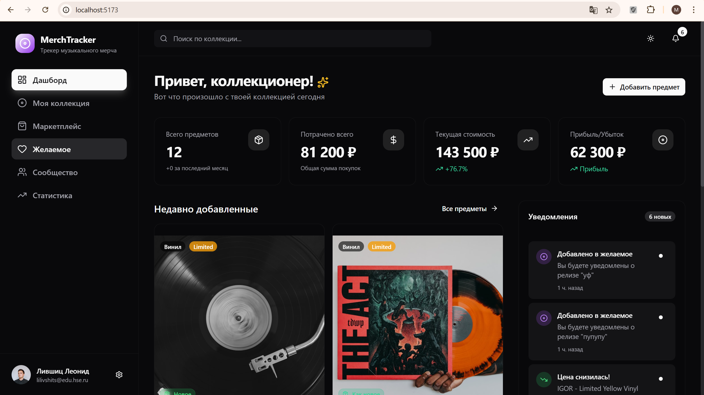
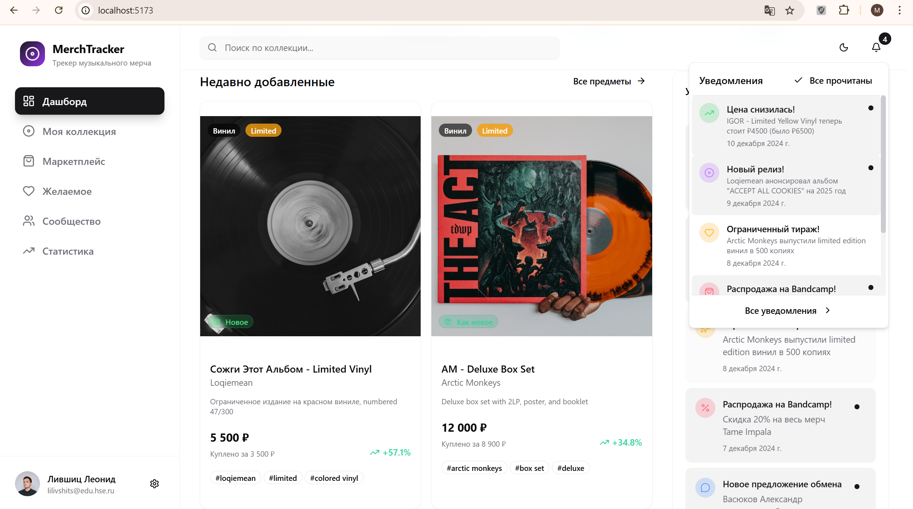

# README

## Список технологий
- **Zustand** (+ `persist`) - локальный стор и persist в `localStorage`
- **Tailwind CSS** - стили
- **shadcn/ui + shadcn primitives** - UI-компоненты (cards, dialogs, select и т.д.)
- **lucide-react** - иконки
- **sonner** - уведомления
- **Zod** - схемы

## Памятка по запуску

**1. Установка (проект в папке `app/`)**
```bash
cd app
npm install

npm install zustand localforage sonner lucide-react
npm install -D vite-plugin-pwa

npm run dev
```

## Структура

```
app/
├─ src/
│  ├─ pages/         # страницы: Collection, Marketplace, Wishlist, Community ...
│  ├─ components/    # переиспользуемые UI/компоненты + custom cards
│  ├─ hooks/         # синхронизация URL, pagination, etc.
│  ├─ stores/        # zustand-сторы (appStore, uiStore, collectionStore)
│  ├─ data/          # мок-данные / загрузчики
│  ├─ utils/         # форматтеры, helpers
│  └─ main.tsx
└─ package.json
```

## Скриншоты стартовой страницы





