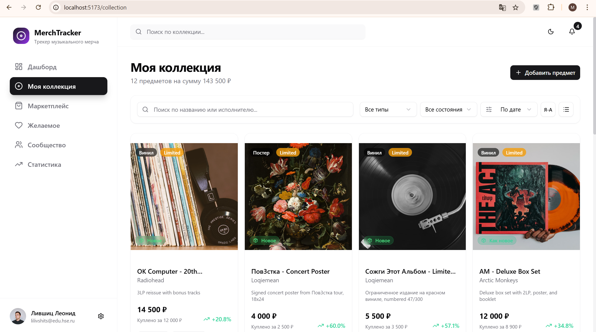
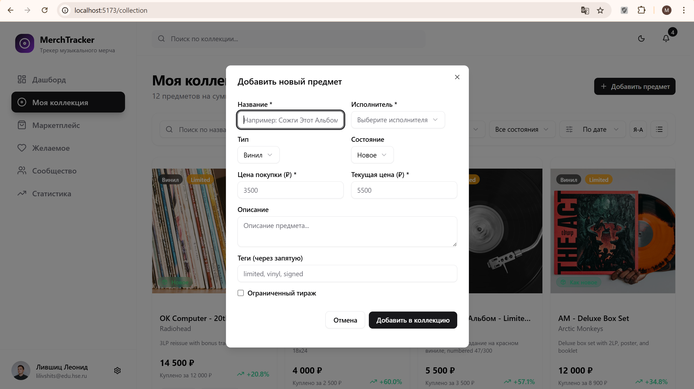
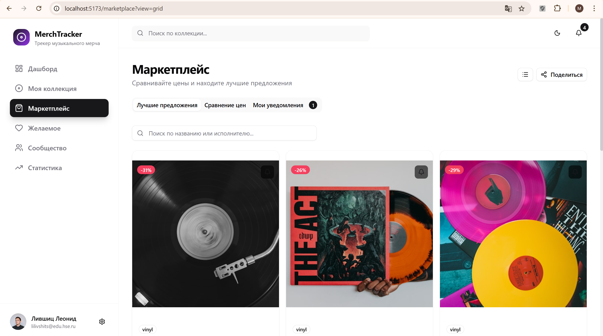
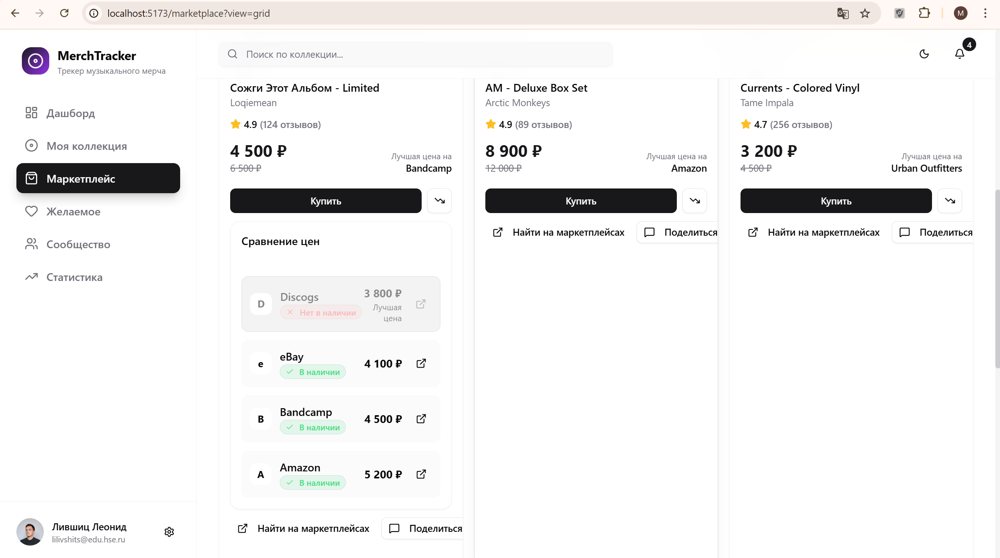
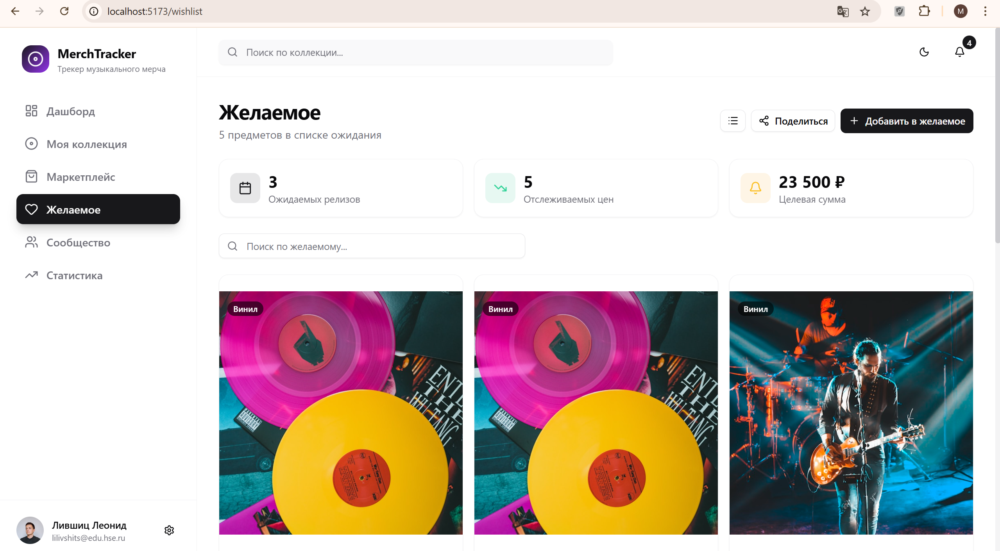
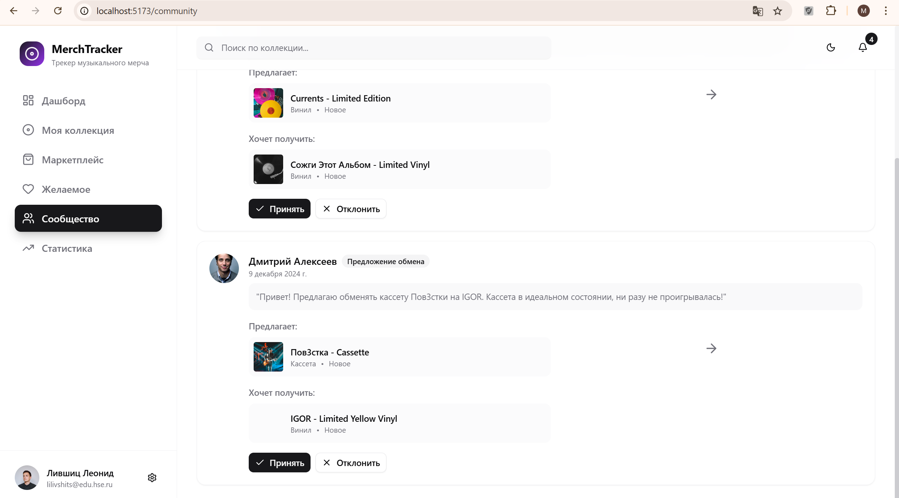
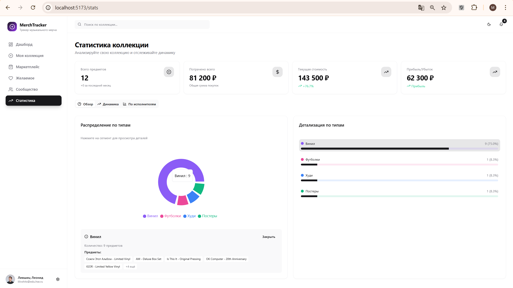
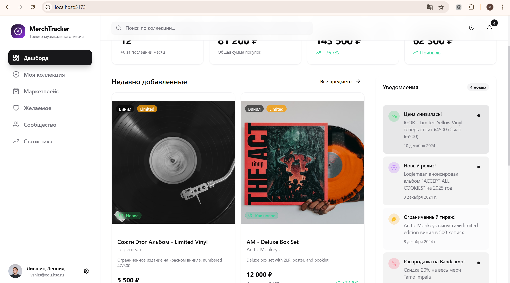
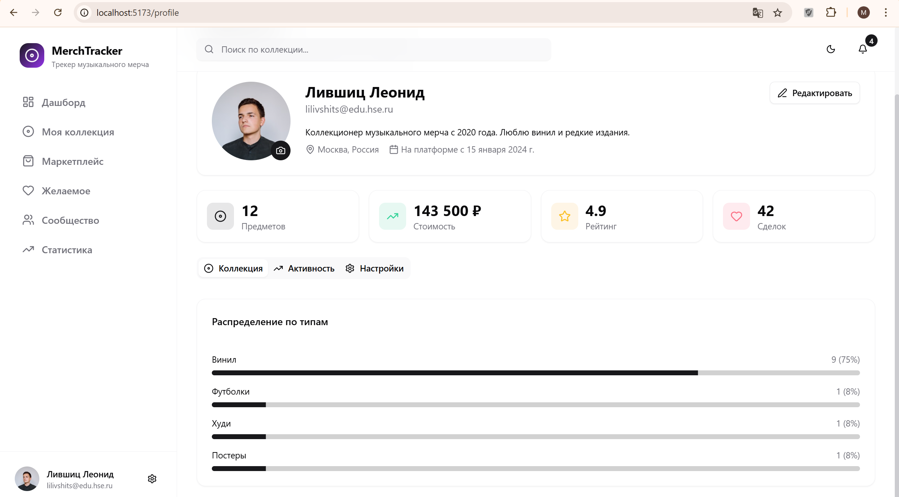

# MerchTracker - Трекер музыкального мерча

**Автор:** Лившиц Леонид Игоревич  
**Технологии:** TypeScript, React, Vite, Tailwind CSS, Zod, shadcn/ui, Zustand  
**Дата:** 10.03.2026

---

## 1. Суть приложения

**MerchTracker** - фронтенд-приложение для коллекционеров музыкального мерча, с упрощенным функционалом личного кабинета коллекционера, маркетплейса сравнения цен и социальной платформы для обмена и продажи между пользователями.

### Ключевые функции:

| Модуль | Описание |
|--------|----------|
| **Личный кабинет** | Каталог коллекции с фото и ценами, статистика (потрачено, количество предметов), отзывы |
| **Wishlist** | Список желаемых релизов с уведомлениями о снижении цен и появлении в продаже |
| **Маркетплейс** | Агрегация (без АПИ) цен с разных площадок, фильтры по исполнителям и типам мерча, сравнение цен |
| **Сообщество** | Обсуждения новых релизов, обмен/продажа между пользователями, рейтинги продавцов |
| **Уведомления** | Новые релизы любимых исполнителей, ограниченные тиражи, скидки и распродажи |
| **Статистика** | Визуализация коллекции через графики (Pie, Bar, Line charts), анализ динамики стоимости |

---

## 2. Архитектура приложения

### 2.1 Диаграмма архитектуры

```
┌─────────────────────────────────────────────────────────────────────────────┐
│                              PRESENTATION LAYER                             │
│  ┌─────────────┐ ┌─────────────┐ ┌─────────────┐ ┌─────────────┐            │
│  │  Dashboard  │ │ Collection  │ │ Marketplace │ │  Community  │            │
│  └─────────────┘ └─────────────┘ └─────────────┘ └─────────────┘            │
│  ┌─────────────┐ ┌─────────────┐ ┌─────────────┐ ┌─────────────┐            │
│  │  Wishlist   │ │ Statistics  │ │   Profile   │ │UserProfile  │            │
│  └─────────────┘ └─────────────┘ └─────────────┘ └─────────────┘            │
├─────────────────────────────────────────────────────────────────────────────┤
│                           CUSTOM COMPONENTS LAYER                           │
│  ┌─────────────┐ ┌─────────────┐ ┌─────────────┐ ┌─────────────┐            │
│  │    Layout   │ │  MerchCard  │ │  StatCard   │ │DiscussionCard│           │
│  └─────────────┘ └─────────────┘ └─────────────┘ └─────────────┘            │
│  ┌─────────────┐ ┌─────────────┐ ┌─────────────┐ ┌─────────────┐            │
│  │Notification │ │PriceCompare │ │ TradeOffer  │ │    ...      │            │
│  │   Item      │ │             │ │    Card     │ │             │            │
│  └─────────────┘ └─────────────┘ └─────────────┘ └─────────────┘            │
├─────────────────────────────────────────────────────────────────────────────┤
│                            shadcn/ui COMPONENTS                             │
│  ┌─────────────┐ ┌─────────────┐ ┌─────────────┐ ┌─────────────┐            │
│  │   Button    │ │    Card     │ │   Dialog    │ │  Dropdown   │            │
│  └─────────────┘ └─────────────┘ └─────────────┘ └─────────────┘            │
│  ┌─────────────┐ ┌─────────────┐ ┌─────────────┐ ┌─────────────┐            │
│  │    Tabs     │ │    Form     │ │  Calendar   │ │   Charts    │            │
│  └─────────────┘ └─────────────┘ └─────────────┘ └─────────────┘            │
├─────────────────────────────────────────────────────────────────────────────┤
│                              STATE MANAGEMENT                               │
│  ┌─────────────────────────────────────────────────────────────────────┐    │
│  │                         ZUSTAND STORES                              │    │
│  │  ┌─────────────┐ ┌─────────────┐ ┌─────────────┐ ┌─────────────┐    │    │
│  │  │  appStore   │ │collectionStore│  uiStore    │ │  (persist)  │    │    │
│  │  │  (global)   │ │  (domain)   │ │  (local)    │ │middleware   │    │    │
│  │  └─────────────┘ └─────────────┘ └─────────────┘ └─────────────┘    │    │
│  └─────────────────────────────────────────────────────────────────────┘    │
├─────────────────────────────────────────────────────────────────────────────┤
│                              DATA LAYER                                     │
│  ┌─────────────┐ ┌─────────────┐ ┌─────────────┐ ┌─────────────┐            │
│  │  JSON Data  │ │  Mock Data  │ │  dataLoader │ │   Types     │            │
│  │  (static)   │ │  (dynamic)  │ │  (enrich)   │ │  (Zod)      │            │
│  └─────────────┘ └─────────────┘ └─────────────┘ └─────────────┘            │
├─────────────────────────────────────────────────────────────────────────────┤
│                           INFRASTRUCTURE                                    │
│  ┌─────────────┐ ┌─────────────┐ ┌─────────────┐ ┌─────────────┐            │
│  │    Vite     │ │  TypeScript │ │  Tailwind   │ │   Zod       │            │
│  │   (build)   │ │   (types)   │ │   (styles)  │ │ (validate)  │            │
│  └─────────────┘ └─────────────┘ └─────────────┘ └─────────────┘            │
└─────────────────────────────────────────────────────────────────────────────┘
```

### 2.2 Структура проекта

```
app/
├── src/
│   ├── components/
│   │   ├── ui/              # 40+ shadcn/ui компонентов
│   │   └── ui-custom/       # Кастомные компоненты приложения
│   ├── pages/               # 8 страниц приложения
│   ├── stores/              # Zustand сторы с persist
│   ├── hooks/               # кастомные React хуки
│   ├── types/               # TypeScript типы + Zod схемы
│   ├── data/                # JSON данные и dataLoader
│   ├── utils/               # Утилиты и форматтеры
│   └── lib/                 # Вспомогательные функции
├── public/                  # Статические ресурсы
└── ...config files
```

---

## 3. Технологический стек

### 3.1 Zustand

**Что это:** библиотека управления состоянием для React

**Зачем использовалась:**
- Управление глобальным состоянием приложения (пользователь, коллекция, уведомления)
- для автоматического сохранения в localStorage

**Почему Zustand, а не Redux:**
- более легкковесный
- Встроенный persist middleware, проще настаривать

---

### 3.2 Zod

**Что это:** библиотека валидации схем со статической типизацией.

**Зачем использовалась:**
- Валидация форм добавления предметов в коллекцию


Не смотрел аналоги

---

### 3.3 shadcn/ui

**Что это:** Коллекция переиспользуемых компонентов, которые можно копировать и настраивать.

**Зачем использовалась:**
- Быстрая разработка ui без написания базовых компонентов с нуля, удобненько
- контроль над стилями через Tailwind

**Компоненты, которые использовал:**
- **Dialog** - окна для добавления/редактирования
- **Tabs** - навигация на странице статистики
- **DropdownMenu** - меню пользователя
- **Card** - карточки предметов коллекции
- **Avatar** - аватарки пользователей
- **Progress** - прогресс-бары в статистике
- **Select** - выпадающие списки фильтров
- **Sonner** - уведомления

**Почему shadcn/ui, а не MUI:**
- возможности кастомизации

---

### 3.4 Sonner

**Что это:** Библиотека для отображения уведомлений

**Зачем использовалась:**
- Уведомления о добавлении/удалении предметов
- Оповещения о новых сообщениях


**Почему Sonner, а не React-Toastify:**
- анимации по умолчанию
- интеграция с Tailwind

---

### 3.5 Recharts

**Что это:** Библиотека для создания интерактивных графиков на React

**Зачем использовалась:**
- Визуализация распределения коллекции по типам (Pie Chart)
- Анализ динамики покупок по месяцам (Line Chart)
- Сравнение количества предметов по артистам (Bar Chart)


Не смотрел аналоги

---

### 3.6 React Hook Form

**Что это:** Библиотека для управления формами

**Зачем использовалась:**
- Управление сложными формами добавления предметов
- Валидация с Zod

не смотрел аналоги

---

## 4. Скриншоты работы приложения

### 4.1 Стартовая страница (Dashboard)


---

### 4.2 Страница коллекции





---

### 4.3 Маркетплейс сравнения цен





---

### 4.4 Wishlist




---

### 4.5 Сообщество (Community)




---

### 4.6 Статистика коллекции




---

### 4.7 Уведомления




---

### 4.8 Профиль пользователя




---

## 5. Что получилось сделать

### Реализованные функции:

1. **Полноценный дашборд** с визуализацией аналитики коллекции
2. **Управление коллекцией** - добавление, удаление с валидацией Zod
3. **Система уведомлений** с разными типами (цена, релиз)
4. **Маркетплейс** с агрегацией цен и фильтрами
5. **Wishlist** с отслеживанием цен
6. **Сообщество** - дискуссии, комментарии, лайки, предложения обмена
7. **Статистика** с интерактивными графиками Recharts
8. **Dark mode** - полная поддержка тёмной темы
9. **40+ UI компонентов** на базе shadcn/ui

### Что не получилось и почему:

1. **Интеграция с реальными API маркетплейсов**

    - не успел, да и запарно немного

2. **офлайн-режим**
   - нужна была настройка vite-plugin-pwa и тестирование, я не успел

3. **Анимации добавления в коллекцию**
   - Не хватило времени


## 6. Заключение

### Рефлексия по проделанной работе

Ну кстати, неплохо, попробовал новые технологии, интересно было, моки конечно много где, но пойдет, хоть и не все получилось хорошо
